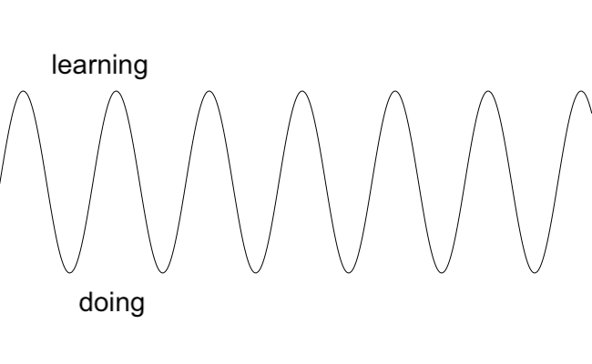
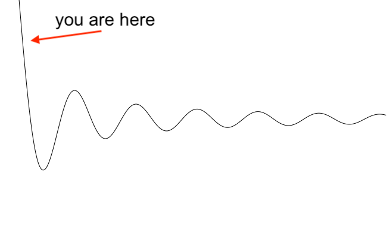

A very common misconception among junior engineers is that they should be as productive as senior engineers. This sucks for everybody, but mostly the junior engineers. They think they're failing to do the same job as senior engineers (solve business problems), while they're supposed to be doing a different job (become senior engineers).

# A Career of Learning

The second most common thing to do with technology is have to learn some new tech stack or language. The first - I hope! - is building, or dreaming of building something, something valuable to the world. But you can't do that until you've learned at least one tech well. _(This post doesn't even address the hard part nobody talks about: how to work on a team to build software. Another day.)_

| ## Alternating between learning and doing |
|  |
|:--:|
| _You are constantly changing mode between learning and doing_ |

Just like everything in life, learning is easier with practice. After ~15 years in tech, learning new technologies has become simple for me - there's a ton of pattern recognition and instinctive navigation of docs. It comes naturally after seeing it in different iterations so many times. Sometimes it's even a pleasant little surprise!

> _Oh, I get to learn Kubernetes finally! Time to write some YAML!_
>
> (This is when the pleasantness fades)

| ## Difficulty of learning over time |
|  |
|:--:|
| _Learning gets easier, the more you do it_ |

But early on in your career, learning can be awful. You struggle for days trying to do something that takes more senior engineers 5 minutes to solve. You get misled by StackOverflow posts, or can't figure out the right search term, or wander into a completely new concept (_"what is a cluster??"_) that you never learned before, and suddenly have to stop building and start learning from 0. Some weeks, you go down 10 dead ends without actually figuring out your problem. I went through it and I remember how frustrating that is!

| ## Effort expended on learning |
|  |
|:--:|
| _So... the first learning period is incredibly hard_ |

# When You Don't Learn

I see junior engineers get sidelined from that good, hard stuff, and they often have two failure modes:

## 1. Beating yourself up about having to learn
aka **"Oh No! I'm Stuck"**

This is understandable, and I remember my first job and the wild emotional swings I went through when I struggled for days or weeks to overcome some seemingly simple problem. It's made worse because you don't know what you "should" know and what you can "legitimately" ask for help with, meaning you don't get unstuck. This means you get blocked at your actual job. Eventually some senior engineer may realize something's off and come ask you how they can help, but in the meantime you can help yourself a bit.

**Fix: get somebody else's view.** Talk to your mentor or a more senior engineer, be honest with them, ask for feedback. 9 times out of 10, you're doing fine.

**Fix: write down what you're learning.** Keep a scratchpad of "Today I Learned." _Here's how I split an array in JavaScript! Here's how I search a git repo for a string!_ Set a reminder at a monthly or quarterly interval and revisit that file: seeing that whole list will help you push back your imposter syndrome.

**Fix: ask great questions.** I can't improve on Julia Evans' amazing posts, [How to ask good questions](https://jvns.ca/blog/good-questions/), and [How to get useful answers to your questions](https://jvns.ca/blog/2021/10/21/how-to-get-useful-answers-to-your-questions/). The best thing you can do is read these and then force yourself to use some of her strategies, and things will get easier _fast_.

**Hey senior engineers**: When I see somebody, for example, panicking about not updating sprint tasks fast enough, I try to take them aside and ask what they've been learning. Focusing on their success helps them realize it exists.

## 2. Refusing to learn from others
aka **"Fake It Till You Make It"**

You can and will learn plenty on your own. You will also learn more, not less, from other people as you progress in your career.

An immature person starts a disagreement with a zero-sum mentality, assuming that if someone has a better suggestion, that means they "lose" something. These are discussions that convert to arguments, as at least one person starts trying to defend themselves, consciously or not.

A mature person understands that their knowledge is finite, and they can always learn from people around them. The best senior engineers I've worked with are open about not knowing stuff - they know it doesn't matter or make them look bad to other senior folks.

**Fix: recognize feeling defensive.** Arguments are usually obvious, because they're stressful. That stress might be enough of a signal for most people - if you're feeling amped up about what should be a collaborative technical discussion, figure out why. Sometimes I catch myself trying to defend beliefs I don't really hold that strongly. When I can shake a little clarity loose, I can recognize that comes from me arguing to the emotions rather than the tech. "Self, why are you worked up about this? Do you really feel that strongly about this, or are you trying to be right?"

**Fix: ask questions.** Start trying to figure out what the disconnect is. The beauty of this strategy is that it works even when you're deep in an argumentative headspace, and whether you're actually correct or not. You don't have to calm down, you just have to fake it.

* To them: _How'd you learn this? What's an example of X being better than Y in the real world?_
* To yourself: _What do I know that this person doesn't? What do they know that I don't? Can I find at least one person who agrees with me?_

Here, you're either setting up a really clear rebuttal, if you're right... or you're finding out the actual gaps in your knowledge. And someone asking lots of questions and really listening to the answers tends to calm arguments back down into discussions.

**Hey senior engineers**: This failure mode can be painful and frustrating. It teaches me patience, and then how to communicate better, and then finally that maybe I'm taking my job too seriously and I should get a drink at 2pm.

When I encounter one of these situations, I usually treat it as an expensive (for the rest of the team) but necessary learning exercise for everybody. The person who isn't listening is going to make a mess, they're going to ship some garbage code, and I'm not going to stop it. Usually the right strategy is containment. Give them a playground to "prove" their ideas out and in 6 months or a year, they and the entire team will be struggling with their work. It sucks that you have to maintain it, but hopefully nobody on that team will ever repeat that type of mistake.

# Embrace The Hard Stuff

Your job early on isn't to magically avoid all the First-Time Learnies (TM). It's to go through them, struggle, and learn a ton of crap that seems useless but you'll use later. Right now you're building a huge amount of context, and how to apply it. The next time there'll be far less context to build, and learning will feel easier (not easy! not yet! but easier). And after you've done this a few times you get amazingly good at pattern recognition. You've learned technologies that are similar enough to understand the new one.

You can still try to be productive here. Don't treat your output as meaningless. Make sure you're working on things that matter. But unless you're a few years into your career, every good company knows that they're hiring an investment, not a senior engineer.

And then you get to start saying something like this to the junior engineers you're working with.

_Thank you to Corrina Fabre, Lotus Tan, and Steven Danneman for reviews and suggestions._
