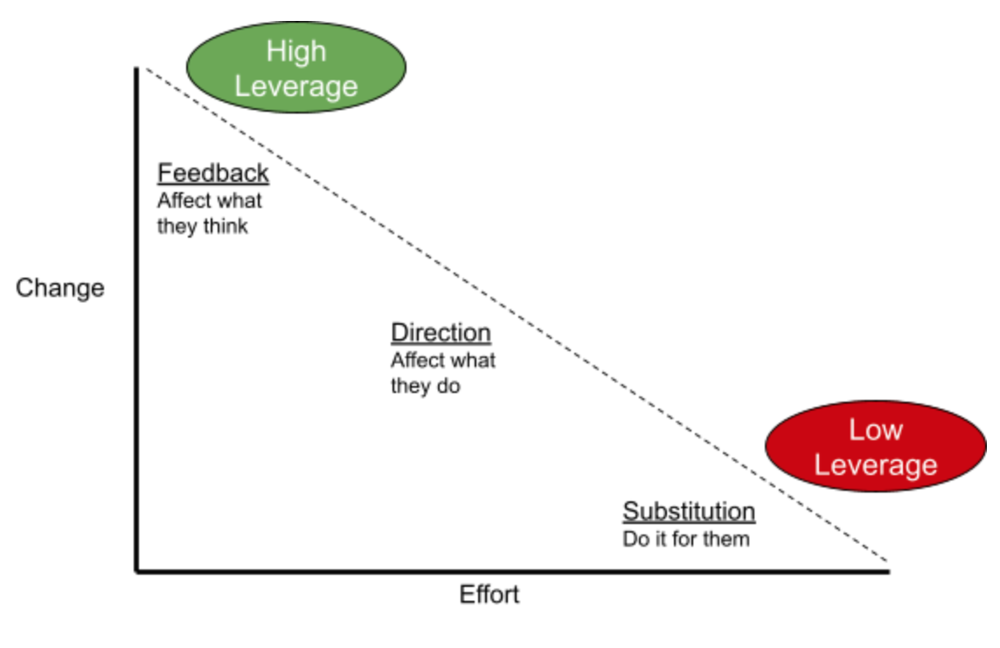
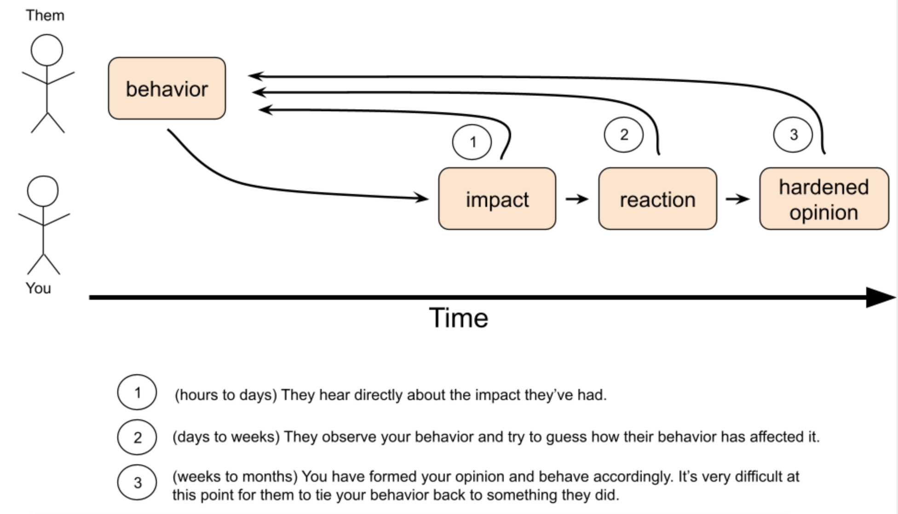

_I originally wrote this as a doc, and did a talk w/ slides in Fall 2020 at Convoy._

_This is very focused on how to work in a software engineering team (surprise! that's most of what I know about!) but I've had friends say they've shown this to their partners, so I suspect it's generally applicable._

I’ve given a lot of direct feedback.
Sometimes it’s been really difficult to do, like when it’s critical feedback to a coworker I don’t know that well.
Other times it’s been fun, like when I remember to actually say out loud "Hey - nice work on that project."
These moments dominate my personal highlight reel from the last five years, because they’ve been great experiences for both of us.

Feedback is a gift.
My goal is to get everyone reading this to give more, and more effective, feedback to their peers.

## Why does feedback matter?

The altruistic answer is that "how am I doing?" is the data hardest for each of us to get, and crucial to improving our impact.
I don’t know what’s going on in your brain, so I don’t know if I’m doing well or poorly.
I can try to guess from your facial expression or the tone of your voice.
When you tell me directly, instead of me trying to guess how my behavior affects you, I can focus on modifying it to have better effects, or at least make a conscious tradeoff.
The **self-interested** answer is that you spend a lot of time working, and you rely heavily on the success of your peers.
Making them more effective directly benefits you.

In both cases, direct feedback to someone is your highest leverage option to get them to be better.
It is the least work on your part for the most long-term impact.

| Maximizing impact |
|  |
|:--:|
| _10x engineering is possible, but it involves talking to people. Sorry._ |

Feedback is high leverage because it’s cheap for you to give, and provides high value to the recipient by giving them information early. Their alternative is having to guess at their own performance and behavioral impact.

A good exercise here is to think back to your most pivotal learning experiences. How many of them include surprising feedback? E.g. the time a teacher or parent was proud of you? Or the time you found out you hurt a friend’s feelings? These are short-lived moments that, in some cases, stick with you your whole life. **Constructing them intentionally for other people can let you have a major impact on them.**

## Principles of good feedback

These are the most important guidelines I’ve found to give feedback effectively. Feedback is effective when the recipient is focused on their own behavior. Feedback is not effective when the recipient is upset, or focused on other peoples’ behavior, or questioning the giver’s motives.

**Praise in public, criticize in private.** If you’re praising someone’s behavior, let their team know! You are encouraging this behavior not just in them, but in all the people witnessing that praise. Criticizing someone’s behavior is an emotionally fraught moment. Don’t make it worse with an audience - they’ll be focused on what the audience thinks instead of focusing on your feedback.

**Use "I" language instead of "you" language.** (specifically for behavioral feedback) You’re the authority on your own feelings and memories. By focusing on those, you give the other person information they don’t already have, and they can react appropriately. You also aren’t guessing at things the other person knows better than you; namely their intentions and what they were thinking. This is also common advice from therapists.

**Be as specific as possible using SBI (situation-behavior-impact).** Don’t tell someone they’re smart, or a jerk, or they have a problem doing X. Tell them specific examples of the behavior you want them to do more or less of. And if you don’t have any… then you probably shouldn’t give this feedback. Avoid Fundamental Attribution Error.

**Be on the same side.** A good feedback interaction involves two people, the giver and recipient, trying to figure out what to do more or less of. If you are tempted to contradict someone, convert that argumentative impulse into a collaboration. Ask questions instead of disagreeing, and say "yes, and" instead of "no." You’re both working together to agree on how things went, and in the case of negative feedback, debug and prevent future issues.

**Stop if you’re too worked up.**
I react very strongly to certain behaviors, and when I'm worked up I have trouble following these guidelines.
When I find myself too upset to think clearly, I avoid giving feedback, or exit the current feedback situation until I can calm down.
Feedback poorly given is probably worse than none, so make sure you're able to do it well.

**Use a tight feedback loop.**
I almost never criticize somebody the first time I notice the need for it.
It takes me a while to recognize the pattern and be confident about my judgment. (_is it me? am I being too picky or sensitive?_)

So by the time I'm ready to give feedback, there's almost always at least two concrete examples (with SBI) that I can pull from.
When the third shows up, I'm ready to talk to the person within minutes, or hours at the outside.
Giving fast feedback is extremely useful, because the feedback recipient can still both remember the behavior, and even recreate some of their internal state.

If they remember doing something that you're criticizing, they can think "Why did I do that?" and focus on the why.

If they remember doing something that you're praising, they can associate praise with that behavior.
They'll remember the next time that good behavior is an option.

| Speeding up the feedback loop |
|  |
|:--:|
| _Tighten the feedback loop for people with timely criticism or praise._ |

## Giving positive feedback

I’ve been trying to focus more on positive feedback lately.
It’s easier to give, it gives everybody the warm fuzzies, and there’s an argument that it’s more effective.
As Francis Frei said recently when she was here speaking: positive feedback is about finding the 10% of things someone’s already doing that are awesome, and saying "yes! do more of that!"
Encouraging an existing behavior requires less convincing than discouraging an existing behavior.

Just like negative feedback, it’s most meaningful if it’s highly specific.
Telling someone they’re awesome at project management sounds like a personal compliment; telling someone they managed X project really effectively lets them know which one went well, and serves as a clear example for others to try to follow.
And make sure you include relevant links or quotes where possible, because it’s easier to see the specific positive behavior.

There’s also an important selfish reason to give positive feedback to someone, which is you build a rapport. If there comes a time you have to give them negative feedback, you’ve already laid groundwork for them to know you’re on their side.

## Giving negative ("constructive"/"critical") feedback

Letting someone know that they’re not performing well, or are behaving in a way detrimental to their team, can be scary.
These are harder conversations that people want to avoid, so they don’t happen as often.
Their rarity makes them super valuable.
Many of my career highlights come as a result of these conversations - specifically the gratitude that many people have expressed afterwards.

Even more than with positive feedback, it’s critically important to follow the principles of good feedback (above).
A personal rule of thumb is to have at least 2 very concrete examples of a problem I want to tell someone about.
Otherwise I might be drawing a trend from a single data point.
Another thing I focus heavily on when describing behavioral outcomes, is only using sentences that begin with "I feel".
That keeps me from accidentally trying to describe what was going on in their head.
Once I’ve said something they know is wrong, like what their motivation was, then my credibility in the rest of the feedback is suspect.

### Template

Because this can be so daunting the first few times, I’ve written up a template. I try to follow this sequence when I give anyone negative feedback.

| Step | What to say | Why? |
| --- | --- | --- |
| 1. Establish context | "I’d like to give you some feedback." | This lets them get ready to hear something hard. These aren’t easy conversations no matter how much trust the two of you may have, and they deserve some warning. |
| 2. Talk about something they’ve done well | "While working on X, you’ve been really good at Y." | Let the person know they can trust you to recognize their good behavior when it occurs. There's a crude cliche for this - "shit sandwich" - but it’s actually effective. You're proving that you see them as a person and you can find things to appreciate about them, not just criticize. |
| 3. SBI: Situation, Behavior | "When doing A, you did B. Specifically, &lt;direct quote, relevant link, reasonable paraphrase of conversation&gt;."  _Describe what an objective observer would see or hear, with no judgment._ | Let them know what details are pertinent to the situation. Often at this point, people will start to recognize what went wrong. And even if they don’t, they should agree with you about what actually happened. |
| 4. SBI: Impact | "When B happened, I felt X. My impression was Y. And it made me concerned that Z."  _Use "I" language to describe what happened in your head._ | This is the new information to the other person. They didn’t know what you thought or felt, and now they do. |
| 5. Talk about the trend. | "This reminded me of &lt;another time where B happened&gt;. It was similar because of &lt;general pattern&gt;." | You don’t always have to have a trend, but it helps. It can reinforce the point that they should consider/modify their behavior in the long-term, and that it wasn’t just a one-off mistake that they’ll never make again. |
| 6. Let them react. | nothing! | Stop talking for a minute. Let them ask questions, or apologize, or argue, or whatever. Receiving this kind of feedback is hard and they may need some time to process it. |

### Things that might happen next

There are lots of types of reactions to negative criticism.
I’ll talk about the ideal outcomes in the next section, but here’s a quick list in order of most-to-least common in my experience.

* They say thanks.
* They ask questions to understand why their behavior had the effects it did, and figure out alternative behaviors that would have been better.
* They ask to stop talking and think about it
* They argue with you about either the behavior, or the impact.

Arguing is pretty rare, but it does happen.

If you’ve carefully followed the SBI model and used "I" language, then you have evidence for what happened.
And if they start to try to invalidate your feelings/opinions, that’s a good time to stop the conversation and escalate to their manager.

Remember: good intentions don’t mean much if the behavior has a negative impact.

### When to NOT give negative feedback

**It’s a difference of opinion.**
If you’re having a disagreement with someone about the right course of action, or priority for your team, or something of that nature, don’t give them "negative feedback" on their difference of opinion.
If their disagreement style could use some work, let them know, but don’t use a feedback session as a chance to push some work-related point that’s still up for debate.

**You have already flipped the bit on someone.**
If you can’t really be on the person’s side, i.e. you have no positive things to say to build trust first, then don’t give them feedback.
Let their manager know about the incident and handle it, and move on.

**You can’t be objective.**
If you’re really upset about the problem, or write down your SBI example and don’t believe your own story, then hit pause.
Take some time, sleep on it, and figure out if this is really feedback you want to stand by.

**It’s been a long time.**
This is a judgement call, but I usually won’t criticize someone more than a week or two after the last example.
Timely criticism is way more likely to land, and I don’t trust my memories past a certain point unless I wrote everything down.

### You might be wrong

This is probably one of the scariest outcomes, and it’s one I’ve been through a few times. I’ve decided to take the plunge and tell someone they’re not meeting expectations, or are having a negative impact on their team… and I realize during the conversation that I didn’t have the whole picture, or my understanding of the situation is off, or I’m criticizing a behavior X when it’s really Y that’s bothering me. It’s an uncomfortable moment.

But I’ve survived these moments, and they’ve usually been productive and trust-building for the relationship. The conversation turns from one where I’m trying to help them, to one where they’re trying to help me learn what I hadn’t known. And remembering them helps keep me humble going into the next time.

## Receiving negative feedback

When someone is giving you feedback, they’re doing you a favor. Even if they’re breaking all the rules in this essay, even if you’re upset to hear about your mistakes, and _even if you think they are wrong and you shouldn’t change your behavior_, they’re giving you the gift of information you didn’t have before. So here are the ways that you can graciously accept it.

**If you need it, ask for time to think.** This is the most important part. Receiving critical feedback can be hard. If you’re having a hard time evaluating it, exit the situation until you can do so. Tell them when you’ll follow up.

**Say thank you.** This was probably a difficult conversation for them to start. They just had to be honest with you about some hard stuff. Appreciate them for that. I usually go with "thank you, I know this was hard to do."

**Deep dive.** If they didn’t have multiple examples, try to figure out the magnitude of the problem. Are there other data points that you can figure out similarities and differences between? Ask why your behavior led to the impact. Ask them for alternative behaviors, or propose them yourself to see if they would have improved the situation.

This can be critical, especially if the feedback hasn’t been delivered effectively. You should feel comfortable evaluating feedback someone gives you for whether you agree.

## On power disparities

**Giving critical feedback to someone more junior than you** can be a crushing experience for them if you do it wrong, or without strong empathy. This is probably the trickiest type of feedback, and you should focus hard on it or just skip it. Even with a strong existing rapport, you should write down what you want to say, how you want to say it, and stick to the script. I’ve made some significant mistakes here, and they’re painful. Do it, but think hard about it first.

**Giving critical feedback to someone more senior** is usually a great way to build trust. People in power don’t get to hear critical feedback often, because people look up to them, or assume they understand everything better, or are just plain scared of them. One adjustment to this scenario though: think hard about what they could have done better. The busier someone is, the less time they’ll have to reflect on a single mistake; help senior folks close their own loop by giving them a clear alternative to what they’ve done.

**Receiving critical feedback from someone more junior**, as I said above, is a wonderful and rare gift. It’s important to encourage and be grateful, even when you can’t immediately act on it.

# Next steps

I hope that after reading this, you understand how important and impactful feedback is.

It’s one thing to hear "you should do this" and another to start doing it, so here’s a list of easy-to-do first steps.

* Add a weekly calendar reminder to yourself to call out a teammate who’s doing well in your team’s Slack channel! Starting with regular positive feedback is a good way to build up the courage to give the critical kind.
* Write down three specific instances of feedback you’ve received in the last months/year. Put them someplace you’ll see them regularly, to remind you of how to improve.
* Reach out to someone who gave you useful critical feedback and say thanks :smile:
* Schedule an hour-long feedback session with a teammate you’ve worked with closely. Ask them to come with specific examples of things you did well and things you didn’t do well. Dive deep with them on the examples, and figure out what you want to do differently in the future.
* Write down critical feedback you’ve wanted to give a teammate. Try to write it down with the template above, and be as specific as you can. You don’t have to send it, but the act of writing it down will help you practice.

Thanks to these folks for a lot of conversations, edits, and suggestions, that led to this doc: my wife Stasi, Steven Wojcio, Shweta Narayan, and the P&E Talks team (Harini Krishnamurthy, Aaron Terrazas, Dawei Huang, Henok Belay, Chris Ellis).

------

# Appendix: Tips And Tricks

Here’s a bunch of miscellaneous techniques I use.

## When giving positive feedback

**Tell the person, and their manager.** I always try to give positive feedback to both the person [and their manager](https://jvns.ca/blog/2020/07/14/when-your-coworker-does-great-work-tell-their-manager/). I’ll try to do it in front of a larger audience (e.g. #engineering) if it’s a behavior I really want to broadly reinforce, or it’s particularly outstanding work. If you’re doing this via Slack or email, use the word "feedback" so you can search for it later at performance review time. I’ll try to write a blurb to send their manager, and then just tell the person separately "I just sent this to your manager, and wanted to make sure I told you too :smile: &gt;quote&lt;".

## When giving critical feedback

**Ask questions before delivering judgment.** Sometimes I’m not 100% confident in what I think is going on. Other times I’m not sure if I’m just repeating something the person already knows and is actively working on. That’s when, instead of me having to go through the exercise of delivering bad news, we can skip that part and discuss how to improve.

**Before giving performance feedback to someone more junior,** ask myself if they’re performing below expectations or if it’s a function of their level of experience. I tend to frame how I speak differently; one is "The expectation for your role is X, and I think you can do better" vs "If you work on X I think you can become really outstanding." It’s an important level-setting exercise that I try to do when I’m clearly in a position of power.

## When receiving positive feedback

Write it down, save it in a google drive folder, or email it to yourself. If it’s in Slack, screenshot it and save the image. If you’re someone who really values external validation - I am - that’s the kind of stuff you’ll discover months or years later and feel really good about.

